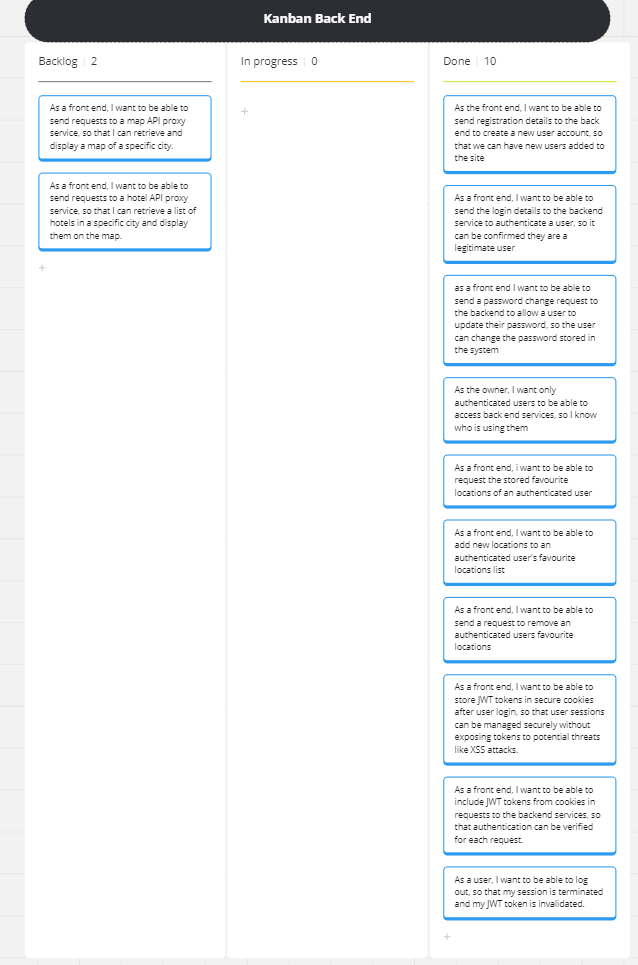

# User Stories

## Core User Stories

### User Story 1

As the front end, I want to be able to send registration details to the back end to create a new user account, so that we can have new users added to the site

### User Story 2

As a front end, I want to be able to send the login details to the backend service to authenticate a user, so it can be confirmed they are a legitimate user

### User Story 3

As a front end I want to be able to send a password change request to the backend to allow a user to update their password, so the user can change the password stored in the system

### User Story 4

As the owner, I want only authenticated users to be able to access back end services, so I know who is using them

### User story 5

As a front end, i want to be able to request the stored favourite locations of an authenticated user

### User Story 6

As a front end, I want to be able to add new locations to an authenticated user's favourite locations list

### User Story 7

As a front end, I want to be able to send a request to remove an authenticated users favourite locations

## Additional User Stories

### User Story 8

As a front end, I want to be able to store JWT tokens in secure cookies after user login, so that user sessions can be managed securely without exposing tokens to potential threats like XSS attacks.

### User Story 9

As a front end, I want to be able to include JWT tokens from cookies in requests to the backend services, so that authentication can be verified for each request.

### User Story 10

As a user, I want to be able to log out, so that my session is terminated and my JWT token is invalidated.

### User Story 11

As a front end, I want to be able to send requests to a map API proxy service, so that I can retrieve and display a map of a specific city.

### User Story 12

As a front end, I want to be able to send requests to a hotel API proxy service, so that I can retrieve a list of hotels in a specific city and display them on the map.
